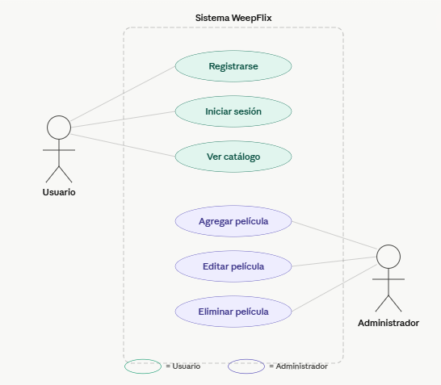
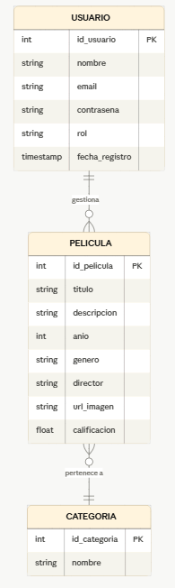

# WeepFlix 🎬

Aplicación móvil de streaming de películas inspirada en Netflix, desarrollada como proyecto académico para la materia de Desarrollo Web del Lado del Servidor.

**Universidad Autónoma de Sinaloa**

---

## Integrantes del Equipo

| Apellidos | Nombre |
|---|---|
| Del Campo Guillén | Alejandro Genky |
| Hernández Morales | Bruno Alain |
| Montes Silva | Jeffry Alejandro |
| Sanz Cortez | Isaac Alberto |
| Valenzuela Camacho | Sergio Leopoldo |
| Vega Zepeda | Said Fernando |

---

## 1. Introducción

WeepFlix es una aplicación móvil de catálogo y streaming de películas. Permite a los usuarios registrarse, iniciar sesión y explorar un catálogo de películas organizadas por categorías. Cuenta con un sistema de administración para gestionar el contenido multimedia disponible en la plataforma.

---

## 2. Resumen del Sistema

WeepFlix es una plataforma móvil que replica la experiencia de un servicio de streaming. Los usuarios pueden crear una cuenta, autenticarse y navegar por el catálogo de películas. Los administradores tienen acceso a un módulo CRUD para gestionar las películas registradas en el sistema.

---

## 3. Requisitos

### a. Funcionales
- El sistema debe permitir el registro de nuevos usuarios.
- El sistema debe permitir el inicio de sesión con correo y contraseña.
- El sistema debe mostrar un catálogo de películas disponibles.
- El sistema debe permitir agregar, consultar, editar y eliminar películas (CRUD).
- El sistema debe permitir cerrar sesión.

### b. No Funcionales
- La interfaz debe ser intuitiva y responsiva.
- Las contraseñas deben almacenarse de forma segura (hash).
- El sistema debe responder en menos de 3 segundos.
- Debe ser compatible con dispositivos iOS y Android.

### c. De Arquitectura del Sistema
- **Frontend:** Diseño mobile-first en Figma
- **Backend:** PHP
- **Base de datos:** MySQL
- **Arquitectura:** Cliente-Servidor (MVC)

---

## 4. Diagramas de Casos de Uso

> 

---

## 5. Descripción de Casos de Uso

| ID | Caso de Uso | Actor | Descripción |
|---|---|---|---|
| CU-01 | Registrarse | Usuario | El usuario crea una cuenta con correo y contraseña |
| CU-02 | Iniciar Sesión | Usuario | El usuario accede con sus credenciales |
| CU-03 | Ver Catálogo | Usuario | El usuario navega por las películas disponibles |
| CU-04 | Agregar Película | Administrador | El admin registra una nueva película |
| CU-05 | Editar Película | Administrador | El admin modifica datos de una película |
| CU-06 | Eliminar Película | Administrador | El admin elimina una película del catálogo |
| CU-07 | Consultar Película | Administrador | El admin visualiza el detalle de una película |

---

## 6. Diagrama Entidad-Relación

> 

---

## 7. Interfaz Figma

[Ver diseño en Figma](https://www.figma.com/design/v8P4ZVTqdvu2PgsIOR1X6M/WEPFLIX)

---

## Cómo ejecutar la aplicación

> *(Próximamente — se detallará al tener el código implementado)*
